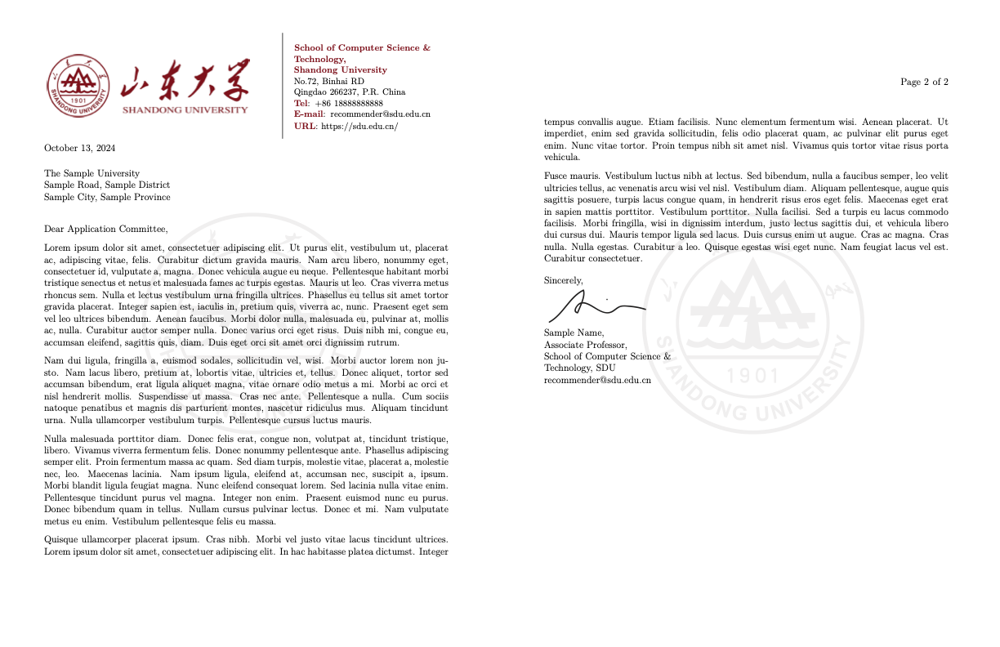

# SDU-letter-template
A LaTeX Template of Recommendation Letter for Shandong University.

山东大学推荐信Latex模板。

## Demo



## Usage

### Method 1: 线上环境

+ 打开[Overleaf]() 链接

- `Open as Template`
- 编辑内容 然后保存即可自动编译

### Method 2: 本地编译

- 安装本地 TeX 环境: https://www.latex-project.org/get
- 克隆本仓库`git clone https://github.com/timerring/SDU-recommendation-letter-latex.git` 或者下载本仓库。
- 修改 `main.tex`文件。
- 可采用命令行直接编译`xelatex main` 或者 在你的 tex 相关 IDE 中直接编译运行。

> 本模板仅支持 UTF-8 编码。如果你使用 tex 相关的 IDE ，强烈推荐使用 `XeTeX` 引擎，请自行在 TeX IDE 中切换引擎。对于其他相关引擎的支持情况未知。

## File layout

更多的细节内容，请根据 tex 中的注释进行修改。

```
.
├── LICENSE
├── README.md
├── SDUletter.cls // 样式文件
├── main.pdf // 生成模版
├── main.tex // tex 文件
├── public // 静态资源
│   ├── fonts // 可以使用的字体（样例未采用 可自行取消文档注释添加）
│   │   ├── Cambria.ttf
│   │   ├── CambriaBold.ttf
│   │   ├── CambriaBoldItalic.ttf
│   │   └── CambriaItalic.ttf
│   └── images // 图像资源
│       ├── background.pdf // 灰色校徽
│       ├── sdu.png // 信封抬头标志
│       └── signature_sample.pdf // recommender 签字样例
└── sample.png // 模版样例
```

## Reference

This project is based on the [Oregon State University Letterhead Template](https://www.overleaf.com/latex/templates/oregon-state-university-letterhead-template/cbxwwnwpvbwf)
